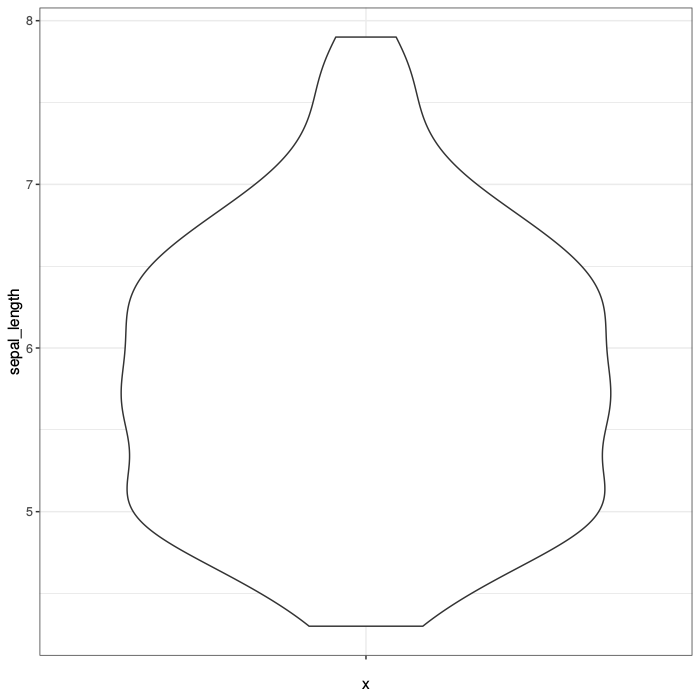
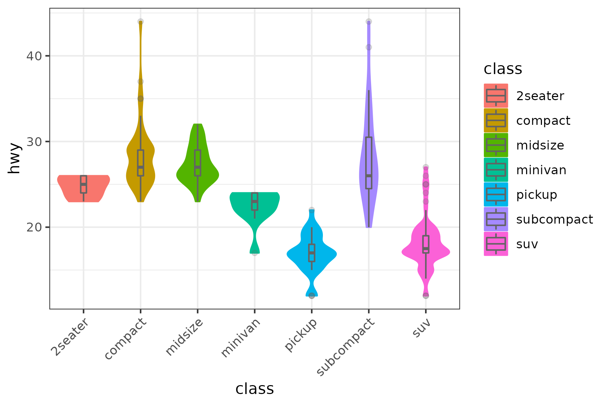

# rugplot: ReUsable Graphics

<!-- badges: start -->
<!-- badges: end -->

The aim of the `rugplot` R package is to provide a tool to quickly
create high quality and customizable visualization plots. The
implemented visualizations can be created in three simple steps. First,
create a ``rug`` JSON file including the parameters for the
visualization. Second, read the ``rug`` parameters file and third, run
a visualization function. It is possible to easily create different
plots including labels, colors and save them in different file
formats, dimensions and resolutions. <!-- This package has been built
on top of [ggplot](https://ggplot2.tidyverse.org/). -->

## Installation in R

You can install the development version of `rugplot` from
[GitHub](https://github.com/) with:

``` r
# install.packages("devtools")
devtools::install_github("rijksuniversiteit-groningen/cds-utils",subdir="rugutils")
devtools::install_github("rijksuniversiteit-groningen/rugplot")
```

## Quickstart

### Create a PCA plot

```r
  library(rugplot)

  # Step 1, create a JSON file and edit the next two parameters
  # "filename": "iris.csv",
  # "colour": "species",
  jsonfile <- create_rugjson(visplot = 'pca')
	
  # Step 2, read the PCA parameters
  rugparams <- read_rugjson(jsonfile, visplot = 'pca')
	
  # Step 3, create and display the visualization plot
  p <- create_rugplot(rugparams, visplot = 'pca')
  p
```



### Detailed explanation

- First step, create the `rug` JSON parameters template. The following
  code will create by default a JSON file called
  `pca_projection_params.json` in the current working directory. The
  filename will be returned in the `jsonfile` variable.

	```r
	library(rugplot)

	jsonfile <- create_rugjson(visplot = 'pca')
	```
	
	Open the file and fill in the required parameters between angle
    brackets `<>`. Assuming that you have the `iris.csv` file, the
    JSON file can be updated as follows:
	
	```json
	{
		"description": "Parameters for a PCA projection using the `rugplot` R package",
		"filename": "iris.csv",
		"colour": "species",
		"...": "..."
	}
	```

	Run `?create_rugjson` to see other possible parameters. Run
    `list_rugplots()` to find the available `rug` plots.

- Second step, read the JSON parameters. The following line will read
  the parameters and store the result in the `rugparams` variable.

  ```r
  rugparams <- read_rugjson(jsonfile, visplot = 'pca')
  ```
- Third step, run the visualization function. The following code will
  create and display the visualization. Run `?create_rugplot` for help.
  
  ```r
  p <- create_rugplot(rugparams, visplot = 'pca')
  p
  ```
  
  Because `p` is just a
  [ggplot](https://ggplot2.tidyverse.org/reference/index.html) object,
  additional layers can be easily added.


## A violin plot example

Given the following `mpg_params.json` and `ggplotmpg.csv` files. 

```json
{
    "filename": "ggplotmpg.csv",
    "y_variable": "hwy",
    "x_variable": "class",
    "colour": "class",
    "fill": "class",
    "rotxlabs": 45,
    "boxplot": {
        "addboxplot": true,
    },
    "save":{
	  "save": true,
	  "width": 15,
	  "height": 10,
	  "device": "png"
	  }
}
```

We can run

```r
  library(rugplot)
  
  # rugplot type
  vplot <- 'violin'
  
  # create the JSON file and update parameters as shown above
  jsonfile <- create_rugjson(visplot = vplot,jsonfile = "mpg_params.json")
  
  # read the parameters
  rugparams <- read_rugjson(jsonfile, vplot)
  
  # create, save and display the plot
  p <- create_rugplot(rugparams,vplot,verbose=TRUE)
  p
```



The files in the examples can be found in this repository in the
folder `tests/testhat/data`.

## `Special` file formats

The `rugplot` R package can generate interactive plots, using
`ggplotly`, by setting "device": "html". Another device option is
`tikz` which generates high quality LaTeX graphics using the
`tikzDevice` R package. Naturally, a LaTeX installation is needed to
generate this high quality visualization plots. If a LaTex intallation
is already in the system, big chances are that `tikzDevice` will find
the LaTeX compiler. If that is not the case you will have to set some
options. Probably you will only need the following option.

```r
options(tikzLatex = '/path/to/pdflatex')
```

See the [tikzDevice documentation]
(https://cran.r-project.org/web/packages/tikzDevice/vignettes/tikzDevice.pdf)
for further details. If LaTeX is not installed in the system,
[tinyTeX](https://yihui.org/tinytex/#for-r-users) could be a good
option.

## `rugplot` Docker container

The visualizations implemented in the `rugplot` R package can be
created using a command line interface.

- The GitHub repository can be found [here](https://github.com/rijksuniversiteit-groningen/docker-cds/tree/venus/feature/readme).
- The ReadTheDocs documentation can be found [here](https://docker-cds.readthedocs.io/en/latest/visualization/rvispack/rvispack.html).

## Information about JSON and JSON schemas

- [JSON](https://www.json.org/json-en.html) 
- [JSONschema](https://www.json.org/json-en.html)
