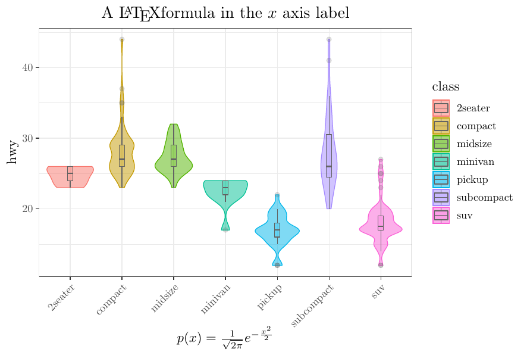

# rugplot: ReUsable Graphics

<!-- badges: start -->
[](https://mybinder.org/v2/gh/rijksuniversiteit-groningen/rugplot/HEAD?urlpath=rstudio)

<!-- badges: end -->

The aim of the `rugplot`, R package based on
[ggplot](https://ggplot2.tidyverse.org/), is to provide a tool to
quickly create high quality and customizable visualization plots.
Visualizations can be created in three simple steps. First, create a
``rugplot`` JSON file including the parameters for the
visualization. Second, read the ``rugplot`` parameters file and third,
run a visualization function. It is possible to easily create
different plots including labels, colors and save them in different
file formats, dimensions and resolutions. 

## Installation in R

You can install the development version of `rugplot` from
[GitHub](https://github.com/) with:

``` r
# install.packages("devtools")
devtools::install_github("rijksuniversiteit-groningen/cds-utils",subdir="rugutils")
devtools::install_github("rijksuniversiteit-groningen/rugplot")
```

## Quickstart

### Create a PCA plot

```r
  library(rugplot)

  # Step 1, create a JSON file and edit the next two parameters
  # "filename": "iris.csv",
  # "colour": "class",
  jsonfile <- create_rugjson(visplot = 'pca')
	
  # Step 2, read the PCA parameters
  rugparams <- read_rugjson(jsonfile, visplot = 'pca')
	
  # Step 3, create and display the visualization plot
  p <- create_rugplot(rugparams, visplot = 'pca')
  p
```


### Detailed explanation

The famous `iris dataset`, (`Fisher, 1936`) can be downloaded
directly from [DataHub iris](https://datahub.io/machine-learning/iris),
by running the following command

```bash
   wget https://datahub.io/machine-learning/iris/r/iris.csv
```

or by adding the link in the previous command to the JSON template
that is created in the first step to create the PCA plot.

- First step, create the `rug` JSON parameters template. The following
  code will create by default a JSON file called
  `pca_projection_params.json` in the current working directory. The
  filename will be returned in the `jsonfile` variable.

	```r
	library(rugplot)

	jsonfile <- create_rugjson(visplot = 'pca')
	```
	
	The JSON file will have many parameters, most of them will have
    default values, fill in the required parameters between angle
    brackets `<>` and the JSON file can be updated as follows:
	
	```json
	{
		"description": "Parameters for a PCA projection using the `rugplot` R package",
		"filename": "iris.csv",
		"colour": "class",
	}
	```

	Run `?create_rugjson` to see other possible parameters. Run
    `list_rugplots()` to find the available `rug` plots. To get
    additional information about the parameters such as description,
    type and default values run the function `display_rughelp(visplot
    = 'pca')`. 

- Second step, read the JSON parameters. The following line will read
  the parameters and store the result in the `rugparams` variable.

  ```r
  rugparams <- read_rugjson(jsonfile, visplot = 'pca')
  ```
- Third step, run the visualization function. The following code will
  create and display the visualization. Run `?create_rugplot` for help.
  
  ```r
  p <- create_rugplot(rugparams, visplot = 'pca')
  p
  ```
  
  Because `p` is just a
  [ggplot](https://ggplot2.tidyverse.org/reference/index.html) object,
  additional layers can be easily added.


## A violin plot example

The following code will generate violin plots as shown in the figure below.

```r
  library(rugplot)
  
  # rugplot type
  vplot <- 'violin'
  
  # create the JSON file and update parameters as shown above
  jsonfile <- create_rugjson(visplot = vplot,jsonfile = "mpg_params.json")
  
  # read the parameters
  rugparams <- read_rugjson(jsonfile, vplot)
  
  # create, save and display the plot
  p <- create_rugplot(rugparams,vplot,verbose=TRUE)
  p
```


After creating `mpg_params.json`, change the following parameters as follows:

```json
{
    "filename": "https://raw.githubusercontent.com/rijksuniversiteit-groningen/rugplot/master/tests/testthat/data/ggplotmpg.csv",
    "y_variable": "hwy",
    "x_variable": "class",
    "colour": "class",
    "fill": "class",
    "rotxlabs": 45,
    "boxplot": {
        "addboxplot": true,
    },
    "save":{
	  "save": true,
	  "width": 15,
	  "height": 10,
	  "device": "png",
	  }
}
```

## `Special` file formats

The `rugplot` R package can generate interactive plots, using
`ggplotly`, by setting "device": "html". An example of an interactive
plot produced with `rugplot` can be found
[here](https://docker-cds.readthedocs.io/en/latest/visualization/rugplot/pcaprojections.html). 

The `tikz` device option can generate high quality LaTeX graphics
using the `tikzDevice` R package. In particular, `rugplot` uses
[tinyTeX](https://yihui.org/tinytex/#for-r-users) and `lualatex` as
compiler. The `tikzLualatex` should be configured providing the LaTeX
path.

```r
# Linux
options(tikzLualatex = "/path/to/lualatex")

# Windows
options(tikzLualatex = "C:\\path_to\\TinyTeX\\bin\\win32\\lualatex.exe")

# both, Windows or Linux
options(tikzDefaultEngine = "luatex")
```

The following command will display the LaTeX path.
```
tinytex::tinytex_root()
```

You may need to install additional packages

```
tinytex::tlmgr_search('luatex85.sty')
tinytex::tlmgr_install('luatex85')
```

See the [tikzDevice
documentation](https://cran.r-project.org/web/packages/tikzDevice/vignettes/tikzDevice.pdf)
for further details. Once `tikzDevice` and `LaTeX` are installed,
setting the `device` option in the JSON parameters file as follows
will be enough to produce a tikz LaTeX visualization.

```r
  "device": "tikz",
```

In addition, if you want to add LaTeX formulae to your `tikz`
graphics, it is necessary to set the `sanitize` parameter to
`false`. Then, it is needed to escape the LaTeX commands by adding
`eight` backslash symbols. For example, to generate a `tikz`
visualization plot using the ``mpg_params.json`` file and include a
formula, the parameters should be modified as follows:

```json
    "labels": {
        "title": "A \\\\\\\\LaTeX formula in the $x$ axis label",
        "x": "$p(x)=\\\\\\\\frac{1}{\\\\\\\\sqrt{2\\\\\\\\pi}}e^{-\\\\\\\\frac{x^2}{2}}$",
	},
	"save" : {
		"save": true,
		"device": "tikz",
		"sanitize": false
	}
```

As a result, we get the following plot.



Tick labels are escaped in a different way, using four backslashes, see [this heatmap](https://docker-cds.readthedocs.io/en/latest/visualization/rugplot/heatmaps.html) as an example. 

NOTE: Only for the `tikz` option, setting `sanitize` to `true` it may
break a LaTeX formula. However, `sanitize` in the `rugplot` R package
is by default `true` because it is expected that some special LaTeX
characters to be found in variable/column names such as underscores
(`_`). If LaTeX formulae are needed, special LaTeX characters (`%`, `_`,
`$`, see the [tikz
documentation](https://search.r-project.org/CRAN/refmans/tikzDevice/html/sanitizeTexString.html)
for further details) should be removed or escaped.

A more direct way to use the `rugplot` R package without the need for
the installation of an R environment is by means of containers.

## `rugplot` Docker container

The visualizations implemented in the `rugplot` R package can be
created using a command line interface.

- The GitHub repository can be found [here](https://github.com/rijksuniversiteit-groningen/docker-cds/tree/venus/feature/readme).
- The ReadTheDocs documentation can be found [here](https://docker-cds.readthedocs.io/en/latest/visualization/rugplot/rugplot.html).

## Information about JSON and JSON schemas

- [JSON](https://www.json.org/json-en.html) 
- [JSONschema](https://www.json.org/json-en.html)
