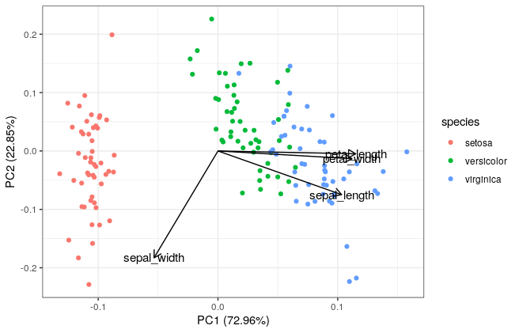

# rvispack

<!-- badges: start -->
<!-- badges: end -->

This [ggplot](https://ggplot2.tidyverse.org/) powered package is still
in development and includes several data visualization
techniques. Currently, the most complete function is to create
`violin` plots. However, other techniques are being implemented such
as `histograms` and `projections`. The later technique is generated as
a result of applying Principal Component Analysis.

## TODO: Containerized version

The visualizations implemented in the `rvispack` package are designed
to be containerized and executed from the command line.

## Installation in R

You can install the development version of rvispack from
[GitHub](https://github.com/) with:

``` r
# install.packages("devtools")
devtools::install_github("rijksuniversiteit-groningen/rvispack")
```

### Implemented visualizations

```
help(package=rvispack)
```

### Help
```
?<function name>
```

For example
```
?c_violin
```

## A simple example

Given the following `violin_parameters_iris.json` file

```json
{
	"filename": "iris.csv",
	"y_variable": "sepal.length"
}
```

and `iris.csv` are in the current working directory.

```r
  # list of parameters lp
  lp <- validate_json_file("violin_parameters_iris.json")

  # Validating the JSON object against the violin schema
  validate_parameters("violin_parameters_iris.json","violin_schema.json")

  # creating the plot
  p <- c_violin(lp)
```

will produce a violin plot in the `Rplots.pdf` file. 




## A more elaborated example

Given the following `mpg_params.json` and `ggplotmpg.csv` files exist
in the same folder. The latter file can be found in
`tests/testhat/data`.

```json
{
    "filename": "ggplotmpg.csv",
    "y_variable": "hwy",
    "x_variable": "class",
    "colour": "class",
    "fill": "class",
    "rotxlabs": 45,
    "boxplot": {
        "addboxplot": true,
    	"width": 0.1
    },
    "save":{
	  "save": true,
	  "width": 15,
	  "height": 10,
	  "device": "png"
	  }
}
```

We can run

```r
  lp <- validate_json_file("mpg_params.json")

  validate_parameters("`mpg_params.json","violin_schema.json")

  p <- c_violin(lp)
```


